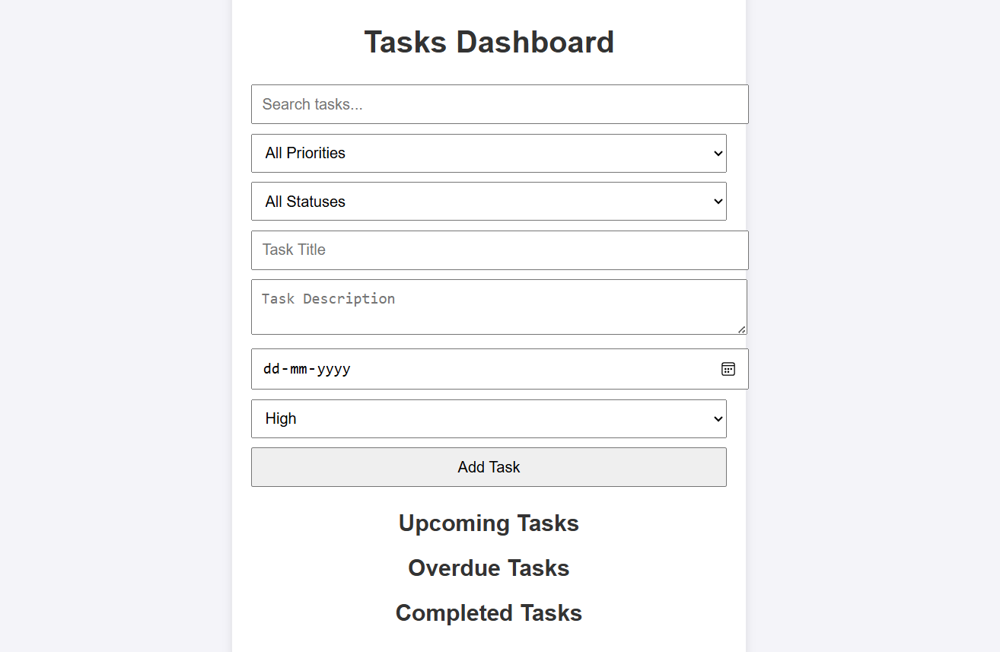
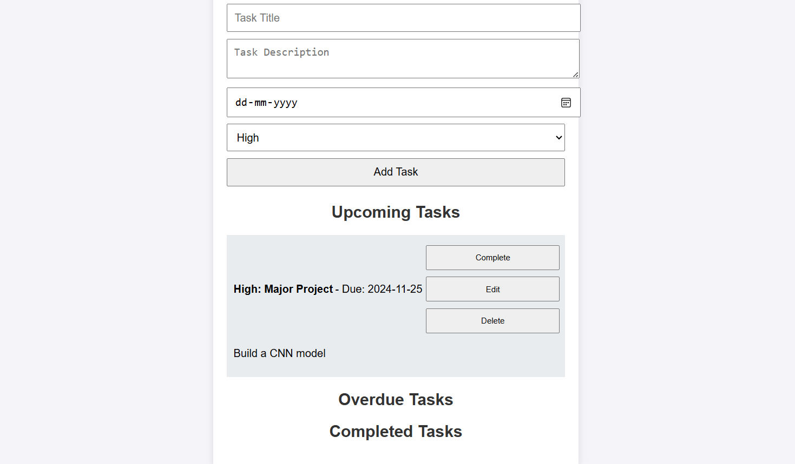
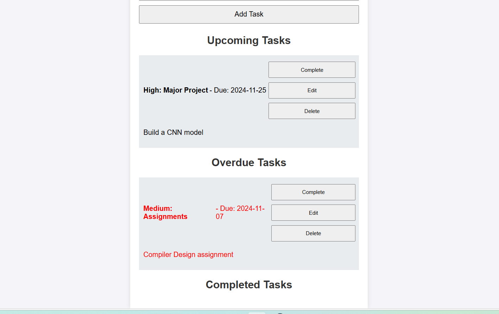
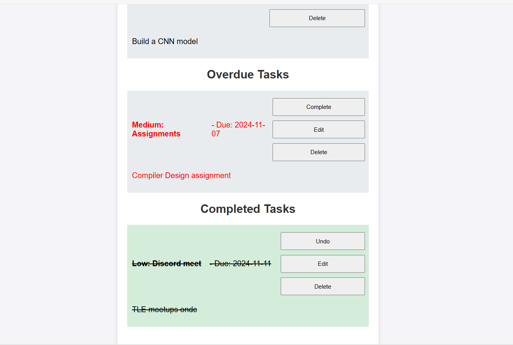

## Task Manager App

A lightweight, browser-based task manager app that helps users organize and prioritize tasks efficiently includes features for adding, editing, deleting, and filtering tasks, with sections for upcoming, overdue, and completed tasks.

## Features

- **Add Tasks**: Enter a task title, description, due date, and select a priority level. Click "Add Task" to save it.
- **Task Prioritization**: Set priority levels for each task: High, Medium, or Low.
- **Categorization**: Tasks are organized into Upcoming, Overdue, and Completed sections.
- **Edit & Delete Tasks**: Use the edit or delete icons next to each task to modify or remove tasks.
- **Mark as Completed**: Click the checkbox next to a task to mark it as completed.
- **Search & Filter**: Use the search bar to find tasks by title or description. Filter by priority or status (Upcoming, Overdue, Completed)
- **Local Storage**: Saves tasks in the browser’s local storage, so your data persists even after refreshing.


## Installation

1. **Clone the repository**:
   ```bash
   git clone https://github.com/your-username/task-manager-app.git
2. **Open the project folder in VS Code or any preferred code editor**.
Run the app locally by opening index.html in your web browser.


## Demo

### Task Manager Dashboard


### Adding a New Task




## Future Additional Features

1. **User Authentication**: 
  Allow users to sign in and save their tasks in the cloud.
2. **Notifications**: 
  Set up reminders for overdue tasks.
3. **Tagging & Categories**: 
   Add custom tags or categories for better organization.
4. **Update to React**

